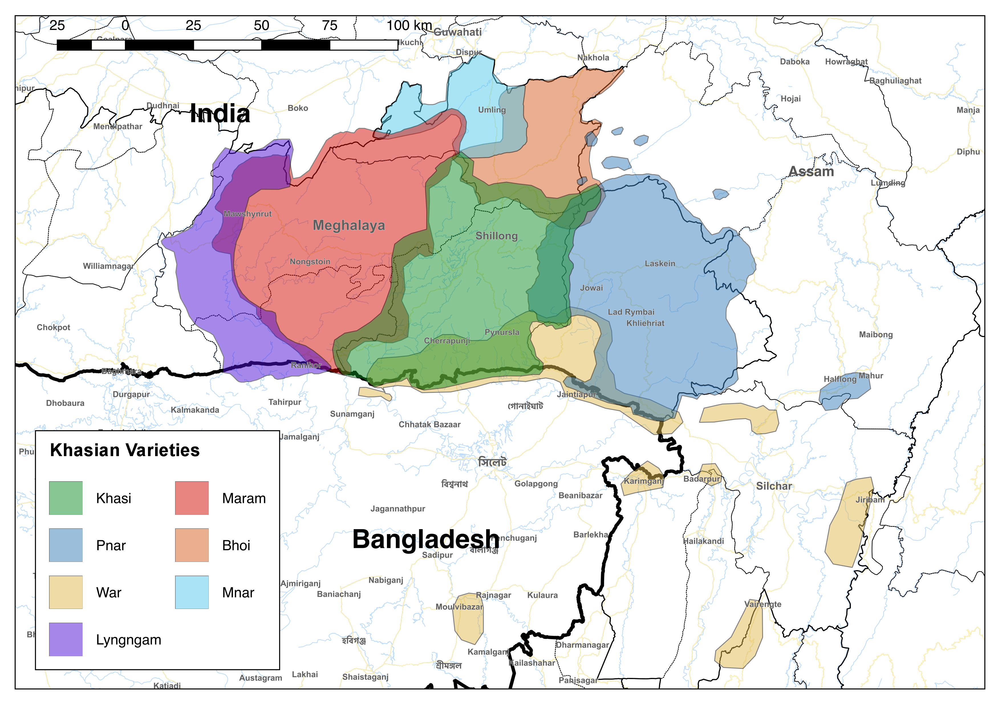

# Maps of Khasian varieties/lects

This repository contains QGIS vector files and shapefiles for making maps of the major Khasian speech varieties in Meghalaya. It also contains a single PNG map of these varieties. The data for these maps comes from fieldwork on these varieties conducted by Hiram Ring, with reference to existing sources such as maps in publications by Anne Daladier and Seino van Breugel.

 You can cite this repository as below, by changing the access date:
- Ring, Hiram. 2018. Maps of the Khasian Varieties. https://github.com/lingdoc/maps-Khasian_lects (accessed 24 Oct 2018).

Contributions are welcome - this is a work in progress.

## Vector formats
The main map file `Khasian_lects.kml` is loadable by most map viewing programs (such as Google Earth). There is also a `Khasian_lects.qlr` file that can be loaded in QGIS, though I am not sure how well it works (needs more testing).

## Individual map shapefiles
Individual polygons are available in ESRI shapefile and KML formats in the individual folders. These polygons overlap, so some adjustment to fill opacity may need to be made before they display correctly. The varieties are largely spoken within the borders of the districts with their associated names, but there has been some migration in the last 200 years, so there is quite a bit of variation in where speakers of the major speech varieties live.
